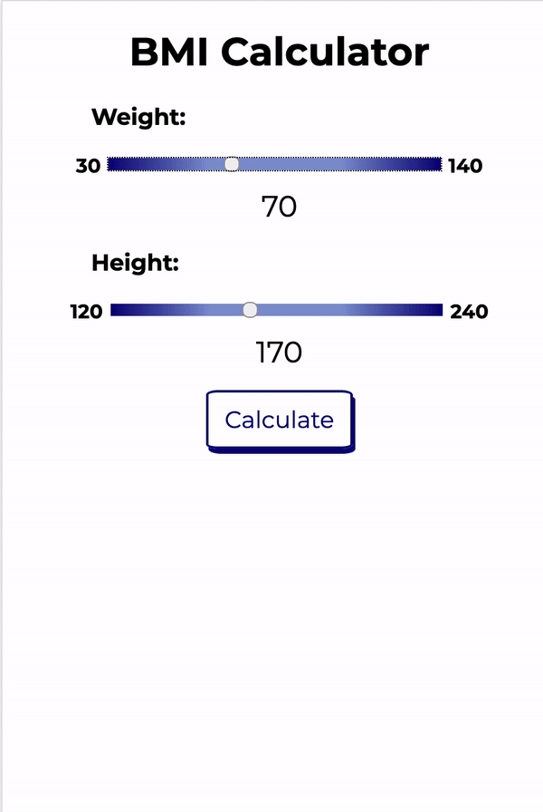

# BMI Calculator

BMI Calculator app built in VanillaJS with browser storage persistence.
The main motive was to get better at using localStorage to persist user state beyond sessions and also to practice css styling. 
If anybody wants to see how to use localStorage, the script.js provides a solid real world example.
